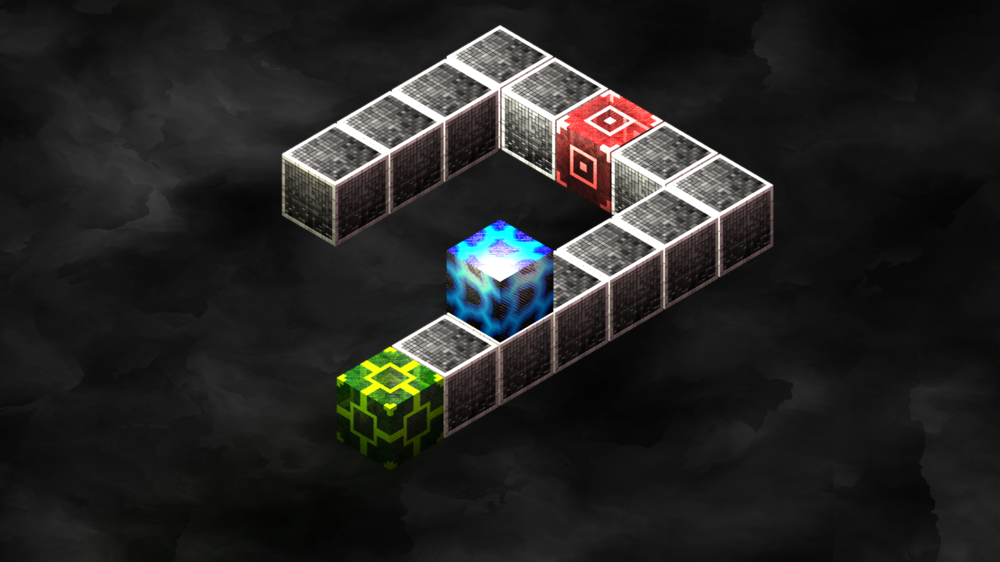
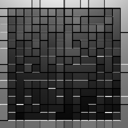
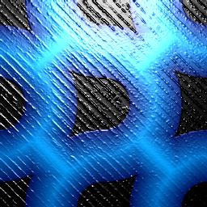
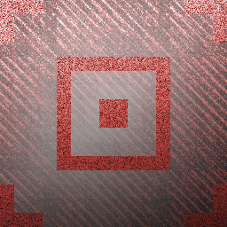
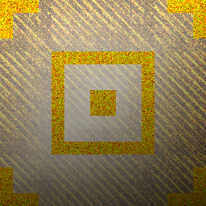
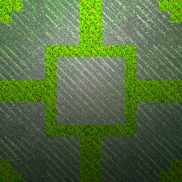
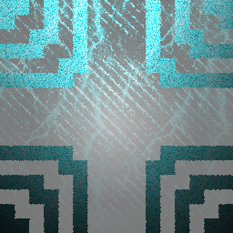

# How to Play WYSIWYG 2

The goal of the game is simple: move the player to a green goal block to advance to the next level. To move the player, click (or tap with a touch screen) in the general direction you want to move the player, i.e. if you want to go to a block that appears to be on the top and left of the player, click on the top left side of the screen.
The player block can rest on top of any other existing block in the game, but different blocks interact with the world and the player block in different ways. Here is a list of all existing blocks and what they do:

Block | Description
----- | -----------------
 | A simple block that does nothing special
 | This is you!
 | A block that rotates the view clockwise. It really puts a new perspective on the game!
 | Like the previous block, but rotates the view in the *opposite* direction
 | The goal block. Land on top of it to advance to the next level
 | Play to find out what this block does!

If you're stuck, press a mouse button for three seconds and a menu will appear. In the backgound, you can rotate the view with the mouse for a better look at the rest of the field. 
